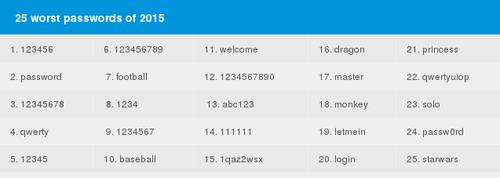
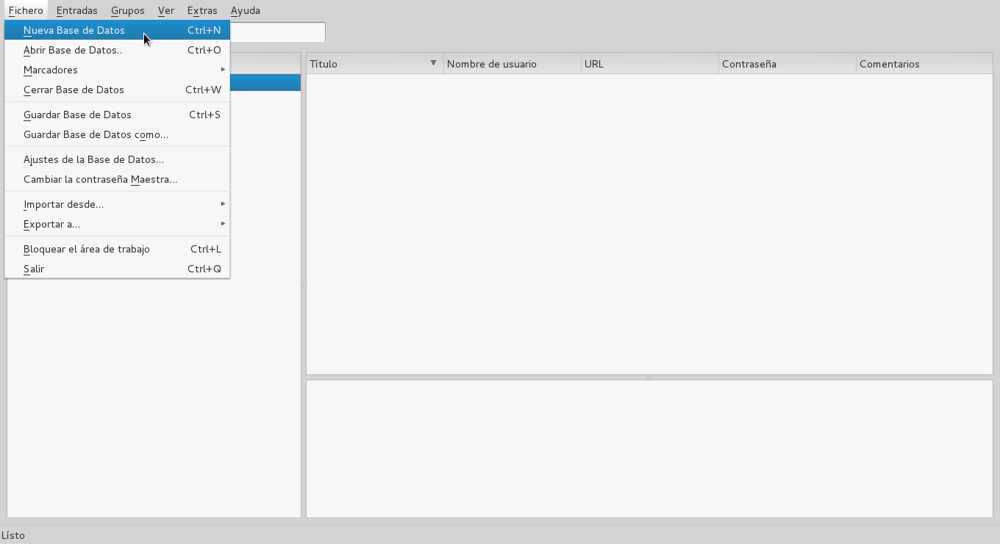
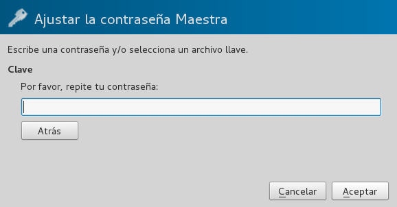
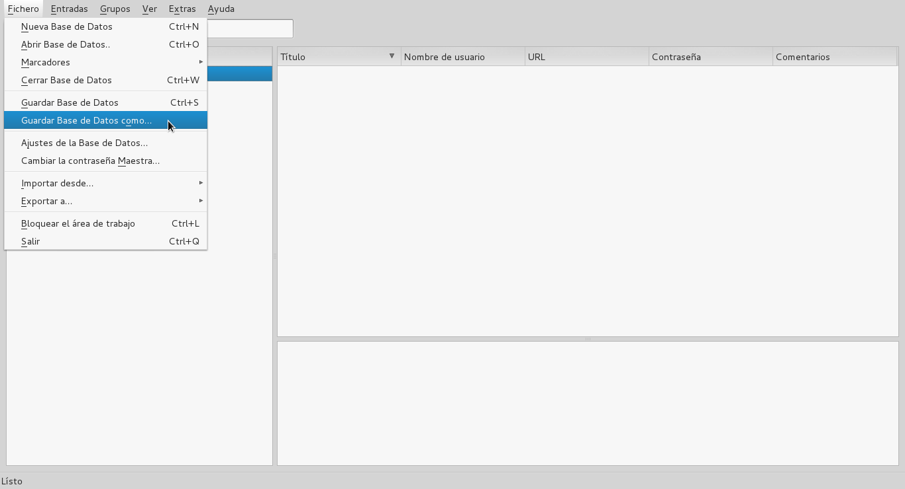
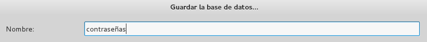
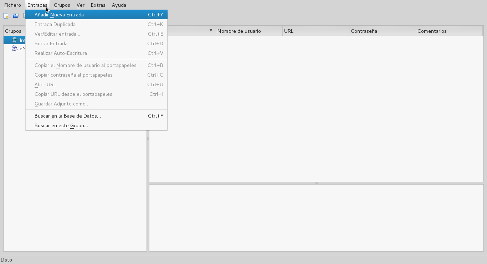
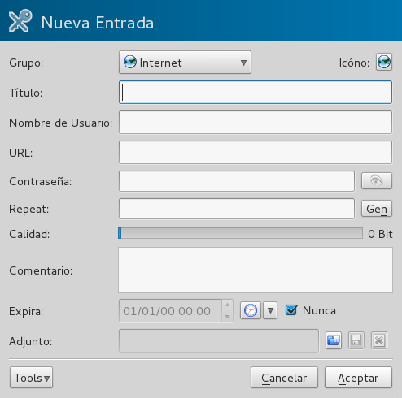

# Contraseñas Seguras

Una contraseña o clave, es una palabra o la unión de un conjunto de caracteres usado como mecanismo de autenticación de usuarios, comunmente implementado para comprobar la identidad de la persona o aprobar algún tipo de acceso.

Por lo general, un usuario de equipos de computación, utiliza contraseñas para diversos propósitos: acceso a su computadora personal, redes sociales, correo electrónico, cuentas bancarias, sitios web, dispositivos móviles, entre otros. Dificultando recordarlas todas y haciendo muy común la mala práctica de seguridad de utilizar la misma contraseña para distintas cuentas.

> Una contraseña puede ser tan fuerte como el servicio menos seguro donde se ha utilizado.

Otro problema muy común con la gestión de contraseñas, es el uso de contraseñas débiles (cortas o muy sencillas) para cuentas críticas, permitiendo a un atacante adivinarlas facilmente, en algunos casos mediante software especializado para estos fines. No es recomendable utilizar contraseñas cortas, de solo números o letras como "123456", "qwerty", "ana", "barcelona", "V12345678" entre otras.

*Las peores contraseñas del 2015 según SplashData*

## Creando y gestionando contraseñas fuertes

Actualmente existen programas que aprovechan al máximo la capacidad de computo para "romper" la seguridad de las contraseñas, y descifrarlas en el menor tiempo posible. Por esta razón es recomendable utilizar contraseñas que tengan por lo menos doce (12) caracteres combinados entre letras minúsculas, mayúsculas, números y símbolos.

> A mayor cantidad y variación de caracteres usados en una contraseñas, más tiempo tardará en ser descifrada. 

Los gestores de contraseñas son herramientas de software que pueden ayudarte a crear contraseñas fuertes y gestionarlas sin tener que memorizarlas todas, solo tienes que recordar una sola contraseña, las contraseña maestra del gestor.

### Gestión de contraseñas con KeePassX
1. Luego de instalar KeePassX en nuestro sistemas, abrimos la herramienta y creamos una nueva base de datos con la opción [Fichero > Nueva Base de Datos].

    

2. Elegimos una contraseña maestra para ingresar a la base de datos. Es importante que esta contraseña sea fuerte y la memoricemos para futuros accesos.

    
    
    
    
3. Guardamos la base de datos creada con el nombre de nuestra preferencia en la opción [Fichero > Guardar Base de Datos como...]
    
    
    
    

4. Creamos una nueva entrada

    
    
    

5. ...

### Usando y configurando KeePassDroid

1. ...

2. ...

## Otras recomendaciones

* Nunca ingresar a tus cuentas desde dispositivos que no sean de tu confianza.
* Cambia tus contraseñas cada 90 días.
* Asegúrese que los sitios web donde ingresas tus contraseñas, utilicen HTTPS.
* Nunca reuses una contraseña.
* Al usar gestores de contraseñas, es muy importante mantener tu computadora libre de software malicioso.
* No guardes las contraseñas en tu navegador.
* Cubre bien tu computadora cuando ingreses tus contraseñas en lugares públicos. Esto evita que alguien pueda verlas o que alguna cámara de vigilancia la capture.
* Utiliza métodos como Diceware para crear contraseñas seguras y fáciles de recordar.

## Enlaces de interes

* [Sitio web de Diceware en español](http://world.std.com/~reinhold/diceware_en_espanolA.htm)
* [Guia de KeePass para entornos Windows](https://info.securityinabox.org/es/keepass_instalar)
* [Repositorio público de KeePassX](https://github.com/keepassx/keepassx)